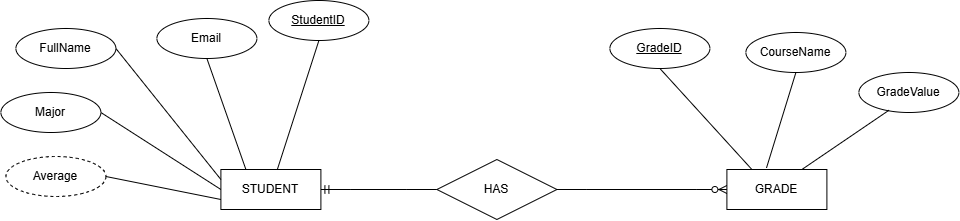

# Student Management System

## Overview

Student Management System is a Windows desktop application for maintaining student records and their course grades. It provides a Windows Forms interface for viewing, searching, adding, editing, and deleting students, as well as managing grades for a selected student.

Application data is persisted locally in an Excel workbook named `Students.xlsx`. The workbook contains separate `Students` and `Grades` worksheets, while the application calculates each student's average from the associated grades.

## User Flow

The application loads student and grade data when it starts. If loading fails, it displays an error and opens an empty student list. From the main student screen, a user can search for students, manage student records, or open the grades screen for a selected student. Changes are validated, saved to Excel, and reflected in the relevant list or average.


## ERD

The ERD documents the relationship between `STUDENT` and `GRADE`. In the implementation, `Student` contains identity and contact fields plus a collection of grades, while `Grade` stores `StudentId`, `CourseName`, and `GradeValue`. `Average` is calculated from a student's grades rather than stored as a separate value.



## Screens

### Main student screen


### Add and edit students


### Delete confirmation and grade management


### Excel data files


## Features

- View students in a tabular Windows Forms interface.
- Search students by student ID, full name, or major.
- Add, edit, and delete student records.
- Validate required student fields and enforce unique student IDs when adding students.
- Add, edit, and delete grades for a selected student.
- Restrict grades to values from 0 to 100.
- Calculate and display each student's average grade.
- Persist student and grade data in a local Excel workbook.
- Display user-friendly validation, loading, and save error messages.

## Architecture

The application follows a three-layer structure:

1. **Presentation layer** — `MainForm`, `StudentForm`, `GradesForm`, and `GradeForm` build the Windows Forms UI, collect user input, and display results or errors.
2. **Business layer** — `StudentService` and `GradeService` apply validation and coordinate student and grade operations.
3. **Data-access layer** — `ExcelManager` creates, loads, and saves the `Students.xlsx` workbook using ClosedXML.

The main dependency flow is:

```text
Windows Forms  ->  Services  ->  ExcelManager  ->  Students.xlsx
```

Students own their grades in memory. When a student or grade changes, the complete student collection is saved back to the workbook.

## Tech Stack

- **Language:** C#
- **Runtime/target:** .NET 10 for Windows (`net10.0-windows`)
- **UI:** Windows Forms
- **Persistence:** Local `.xlsx` workbook
- **Excel library:** ClosedXML `0.104.2`
- **IDE/project format:** Visual Studio-compatible .NET project (`.csproj`)

## Project Structure

```text
StudentManagementSystem/
├── Program.cs                 # Application entry point
├── ExcelManager.cs            # Excel workbook creation, loading, and saving
├── Models/
│   ├── Student.cs              # Student model and calculated average
│   └── Grade.cs                # Grade model
├── Services/
│   ├── StudentService.cs       # Student validation and operations
│   └── GradeService.cs         # Grade validation and operations
├── Forms/
│   ├── MainForm.cs             # Main student list and actions
│   ├── StudentForm.cs          # Add/edit student dialog
│   ├── GradesForm.cs           # Grades list for a selected student
│   ├── GradeForm.cs            # Add/edit grade dialog
│   ├── MainForm.resx           # Windows Forms resource file
│   └── StudentForm.resx        # Windows Forms resource file
├── docs/                       # User flow, ERD, UI, and Excel screenshots
├── StudentManagementSystem.csproj
├── StudentManagementSystem.slnx
├── .gitignore
└── README.md
```
